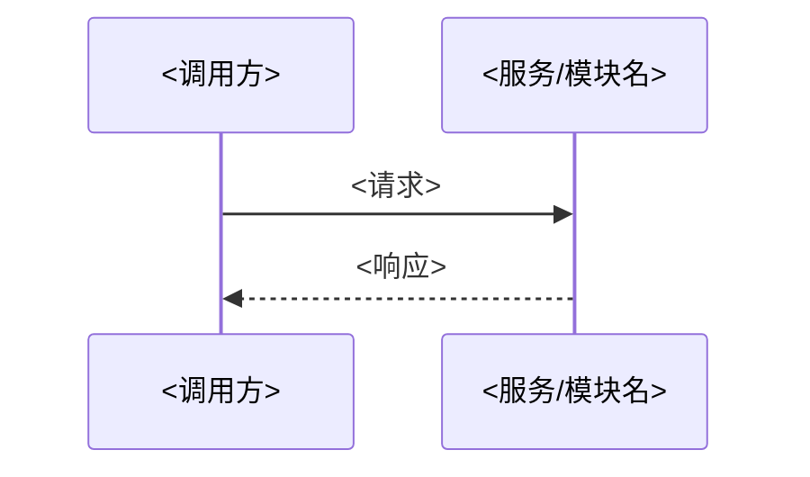

# 研发方案：<design-id> <标题>

> 由 `hc-design` skill 引导式设计对话产出（设计者一条连贯推演、决策点用户拍板、定稿用户审核 + `hc-design-reviewer` 对抗评审）。落 `docs/designs/<id>/`。
> 接口契约不写这里，单独落同目录 `api-contract.md`（④ 只放链接 + 概述 + 设计原则）。
> 产出门槛：查 / 问 / 决策点把不确定**全部消解**、用户审核通过，才落本方案；**定稿必须可执行、零 TBD / 待确认**（正文不留"待确认"段）。

## ① 背景 & 范围

> 为什么做、给谁用、在什么场景、边界在哪。范围既写"做什么"，也写**不做什么**（业务边界）。

- 核心目标：<这次设计要达成的技术/业务结果，如"为 <服务/模块名> 增加 <能力>">
- 目标用户：<谁会用到这块能力，如"<调用方服务> / 终端用户">
- 使用场景：<典型场景，如"<角色> 在 <场景> 下 <做什么>">
- 业务边界（不做什么）：<本次明确不覆盖的，如"不涉及 <某能力>、不改 <某模块>">

## ② 业务流程（技术视角）

> 从技术视角描述系统怎么走。**文字描述必填**；流程图 / 时序图可选（要画就用 mermaid 或链接到图）。三类都要交代：主流程、分支流程、异常流程（异常这里写"出异常时系统怎么走"，与 ⑧ 的"有哪些业务异常码"不同）。

- 主流程：<正常路径逐步，如"① 调用方发起 <请求> → ② <服务> 校验 <…> → ③ 写 <数据> → ④ 返回 <结果>">
- 分支流程：<条件分叉，如"若 <条件A> 则走 <路径1>，否则走 <路径2>">
- 异常流程：<出错时系统怎么走，如"<下游> 超时 → <服务> 重试 N 次 → 仍失败则 <降级/回滚>，对外返回 <受控错误>">

<!-- 可选：mermaid 流程图 / 时序图

-->

## ③ 数据模型

> 数据怎么存。按项目实际选填——关系型给表结构（字段 / 索引 / 约束），非关系型给 JSON 结构 / 缓存键 / 对象存储布局；特殊字段单独说明。**无持久化的设计直接标『无』、不强凑表**；没有的项略过、不硬凑。

- 实体关系（ER）：<实体与关系，如"<实体A> 1—N <实体B>"；可附 ER 图>
- 表结构（关系型）：

| 表 `<table_name>` | 字段 | 类型 | 约束 / 索引 | 说明 |
|---|---|---|---|---|
| | `<id>` | `<bigint/uuid>` | 主键 | <说明> |
| | `<field_a>` | `<type>` | <非空 / 唯一 / 外键 / 索引> | <说明> |

- 非关系型（按需）：<JSON 文档结构 / 缓存键与 TTL / 对象存储路径布局，如"缓存键 `<prefix>:<id>`，TTL <N>s">
- 特殊字段：<枚举 / 状态机 / 软删标记 / 时间戳 / 加密字段等，如"`status` 枚举：<取值集合>；`<field>` 落库前加密">

## ④ 接口设计

> **正文在同目录 `api-contract.md`**——本段只放：链接 + 一句话概述 + 接口设计原则。不在这里铺端点细节。
> **契约可选**：**有对外接口才产 `api-contract.md`**；纯内部重构 / 数据迁移类、无对外接口的设计——本段直接标「**N/A：无对外接口**」并删掉占位，**不强凑契约**（对齐 `scripts/designs-audit.sh` 与 `docs/designs/README` 的"契约可选"，机检不会因缺它报错）。

- 契约位置：[`api-contract.md`](./api-contract.md)
- 概述：<一句话说明本设计涉及哪些接口，如"围绕 <资源> 的 增 / 查 / 改 N 个端点">
- 接口设计原则（设计阶段确认，防下游理解偏差）：
  - 接口形态按工程实际（REST / gRPC / 消息 / 异步）——`api-contract.md` 里的 Method / Path / HTTP 状态码等字段名是**通用占位**，gRPC 用 rpc 名 + status / enum reason、消息用 topic + 事件 schema，按实际换。
  - 字段 / JSON 结构在**设计阶段定死**——名字、类型、嵌套、可空性都确认到位，不留给实现时即兴。
  - 语义清晰：字段名表意、单位 / 时区 / 枚举取值显式，不靠调用方猜。
  - 返回结构统一：成功 / 错误响应遵循项目统一外壳（如统一 `{ code, message, data }` 或既有约定），错误码引用 ⑧ 的**约定内错误码**（业务码 / 校验码 / 鉴权 / 约定服务态），与 `api-contract.md` 错误响应表对齐（⑧=各端点错误表的并集、单端点表是其子集，非逐行相等）。

## ⑤ 技术要点

> 实现上的难点 / 特殊逻辑 / 性能 / 架构考虑。把"哪里不 trivial、为什么"讲清楚，便于实现者与评审抓重点。没有难点的简单设计可精简本段。

- 实现难点：<如"<某并发场景> 下的一致性如何保证">
- 特殊逻辑：<如"<某业务规则> 的计算 / 状态流转细节">
- 性能：<如"<热点接口> 预期 QPS <N>，靠 <缓存 / 索引 / 异步> 兜">
- 架构考虑：<如"放在 <哪一层 / 哪个服务>、与 <现有模块> 如何协作、为什么不放别处">

## ⑥ 关键决策 + 备选

> 设计岔路上拍过的决策留痕（像 ADR 的备选栏）：选了什么 / 备选有哪些 / 为什么这么选。决策点应是**用户参与拍板**的那些（选型 / 接口怎么切 / 数据怎么存）。

| 决策点 | 选定方案 | 备选方案 | 取舍理由（为什么选它 / 为什么弃备选） |
|---|---|---|---|
| <如"数据如何存储"> | <选定，如"<方案A>"> | <备选，如"<方案B> / <方案C>"> | <理由，如"<方案A> 满足 <约束>，<方案B> 在 <维度> 上不达标"> |

## ⑦ 影响范围

> 这次设计动了哪些既有的东西。便于评估改动半径、回归面、协作方。

- 模块 / 服务：<受影响的代码模块或服务，如"<模块名> / <服务名>">
- 接口：<新增 / 改动 / 废弃的接口，如"新增 <端点>；改动 <端点> 的 <字段>">
- 数据：<新增 / 变更的表 / 字段 / 迁移，如"新增表 `<table>`；给 `<table>` 加列 `<col>`（需迁移）">
- 上下游：<受影响的调用方 / 被调方，如"<上游调用方> 需适配新字段；依赖 <下游服务> 的 <能力>">

## ⑧ 异常

> **约定内错误枚举 + 业务 code**——供 `api-contract.md` 的错误响应**逐条引用**（本段列的码 = 契约错误响应里用得上、对得齐的码，别一边列一边漏）。与 ② 的"异常流程"分工不同：② 写"出异常时系统怎么走"，本段写"有哪些约定内错误、各自的码与触发条件"。
> 边界按「**约定 / 未约定**」切，**不按状态码段一刀切**。约定内的错误都列，含四类：① 业务码（领域语义，如资源不存在 / 状态冲突）；② 校验码（400 参数非法 / 422 字段校验失败）；③ 鉴权类（401 未认证 / 403 无权限——属约定错误，语义归 ⑨ 授权）；④ **约定的服务态**（如 503 `DB_UNAVAILABLE`——仅当工程把它当契约级、有 resilience 测试硬断言时列）。**未约定的未预期故障**（裸 500 / panic）不列，那是平台层兜底——但"不列 500/5xx"是错的口径：约定的 503 该列。
> 下面示例的业务码须与 `api-contract.md` 错误响应表对得上（⑧=各端点错误表的并集、每端点是其子集，非逐行相等）（同名同 HTTP 状态）。`类别` 列标该码属上面哪类，便于 reviewer 用"约定 / 未约定"口径核闭合（而非误用窄的"业务码一一对应"，那会把合法的 401/403/503 当多余）。

| 业务 code | 类别 | 场景 / 含义 | 触发条件 | HTTP 状态（如适用） |
|---|---|---|---|---|
| `INVALID_QUERY` | 校验码（约定） | <如"查询参数非法"> | <如"分页越界 / 过滤值非枚举"> | 400 |
| `VALIDATION_FAILED` | 校验码（约定） | <如"字段校验失败"> | <如"<字段> 不满足 <约束>"> | 422 |
| `UNAUTHENTICATED` | 鉴权（约定，语义见 ⑨） | <如"未认证"> | <如"缺 token / token 失效"> | 401 |
| `FORBIDDEN` | 鉴权（约定，语义见 ⑨） | <如"无权限"> | <如"已认证但无权操作该资源"> | 403 |
| `CONFLICT` | 业务码 | <如"资源冲突"> | <如"<资源> 唯一键已存在"> | 409 |
| `DB_UNAVAILABLE` | 约定服务态（按需） | <如"依赖不可用"> | <如"数据库 / 关键下游不可用"> | 503 |

## ⑨ 安全 & 风险

> **通用**安全考量 + 可预期风险 + 缓解。安全维度按项目实际填——鉴权 / 授权 / 敏感数据 / 访问控制；不预设任何具体项目模型（如不预设多租户隔离），项目真有再写。

- 鉴权：<谁能调、怎么认身份，如"需 <凭证类型>，未认证返回 <码>">
- 授权：<认证后能不能做这件事，如"仅 <角色 / 权限> 可 <操作>">
- 敏感数据：<有无敏感字段、怎么保护，如"`<field>` 落库加密 / 传输脱敏 / 日志不打印">
- 访问控制：<资源级隔离 / 越权防护，如"调用方只能访问 <其有权的资源>">
- 可预期风险 + 缓解：

| 风险 | 影响 | 缓解措施 |
|---|---|---|
| <如"<下游> 不可用"> | <如"<功能> 不可用"> | <如"<降级 / 熔断 / 重试> + 监控告警"> |

---

> 本模板为通用指导，可按设计复杂度增删章节——简单设计精简、复杂设计细化；但 ④ 的接口契约务必落到独立的 `api-contract.md`。
